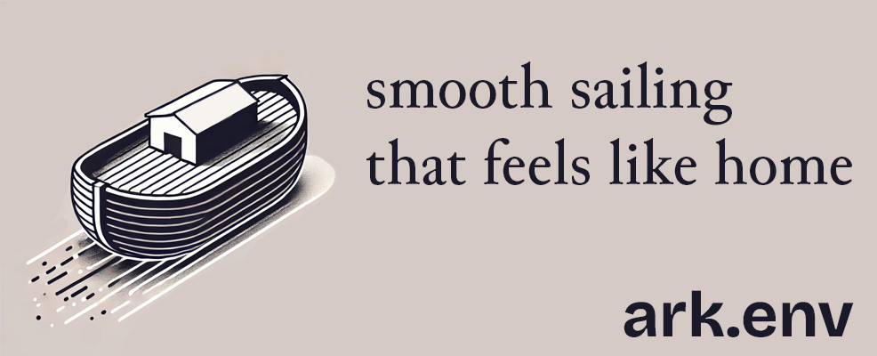

## Installation

<details open>
<summary>Using npm</summary>

```sh
npm install ark.env
```
</details>

<details>
<summary>Using pnpm</summary>

```sh
pnpm add ark.env
```
</details>

<details>
<summary>Using yarn</summary>

```sh
yarn add ark.env
```
</details>

<details>
<summary>Using bun</summary>

```sh
bun add ark.env
```
</details>

## Quick Start

```ts
import { createEnv } from 'ark.env';

const env = createEnv({
  PORT: 'number',
  DATABASE_URL: 'string',
  NODE_ENV: ['development', 'production', 'test']
});

// Automatically validates and parses process.env
// TypeScript knows the exact types!
console.log(env.PORT); // number
console.log(env.NODE_ENV); // 'development' | 'production' | 'test'
```

## Features

- 🔒 **Type-safe**: Full TypeScript support with inferred types
- 🚀 **Runtime validation**: Catches missing or invalid environment variables early
- 💪 **Powered by ArkType**: Leverages ArkType's powerful type system
- 🪶 **Lightweight**: Zero dependencies, minimal bundle size
- ⚡ **Fast**: Optimized for performance with minimal overhead

## Documentation

For detailed documentation and examples, visit our [documentation site](https://github.com/yamcodes/ark.env/docs).

## Thanks / Inspiration

Find projects and people who helped or inspired this project in [THANKS.md](./THANKS.md). Thank you 🙏