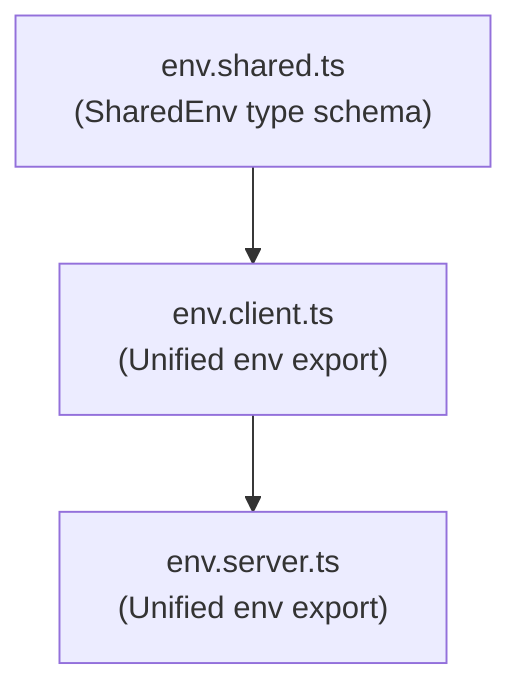

> [!IMPORTANT]
> This integration requires [ArkType](https://arktype.io) to be installed.

The `@arkenv/nextjs` integration provides end-to-end environment validation for both the server and the browser. It catches configuration bugs early in your build pipeline and prevents sensitive server-side variables from ever reaching client components.

## Recommended Architecture (Separate Files)

For maximum security, we recommend a **3-file layout** (`env.shared.ts` → `env.client.ts` → `env.server.ts`). This structure aligns with Next.js's native `use client` boundary model, ensures that server secrets are compile-time locked from browser bundles, and allows a single unified `env` export path.



### 1. Define Shared Variables

Create `env.shared.ts` to define schema variables that are shared across both the client and the server. We treat this as a runtime type, so it is defined using PascalCase:

```ts title="src/env.shared.ts" twoslash
import { type } from "@arkenv/nextjs/shared";

export const SharedEnv = type({
	NODE_ENV: "'development' | 'production' | 'test' = 'development'",
});
```

### 2. Define Client Variables

Create `env.client.ts` using `@arkenv/nextjs/client`. All local keys **must** be prefixed with `NEXT_PUBLIC_`. You must extend `SharedEnv` and provide the destructured `runtimeEnv`:

```ts title="src/env.client.ts" twoslash
// @filename: env.shared.ts
import { type } from "@arkenv/nextjs/shared";
export const SharedEnv = type({
	NODE_ENV: "'development' | 'production' | 'test' = 'development'",
});

// @filename: env.client.ts
// ---cut---
import { createEnv } from "@arkenv/nextjs/client";
import { SharedEnv } from "./env.shared";

export const env = createEnv(
	{
		NEXT_PUBLIC_API_URL: "string = 'https://api.example.com'",
	},
	{
		extends: [SharedEnv],
		runtimeEnv: {
			NEXT_PUBLIC_API_URL: process.env.NEXT_PUBLIC_API_URL,
			NODE_ENV: process.env.NODE_ENV,
		},
	},
);
```

### 3. Define Server Variables

Create `env.server.ts` using `@arkenv/nextjs/server`. It extends the client `env` to merge all client, shared, and server variables into a single output:

```ts title="src/env.server.ts" twoslash
// @filename: env.shared.ts
import { type } from "@arkenv/nextjs/shared";
export const SharedEnv = type({
	NODE_ENV: "'development' | 'production' | 'test' = 'development'",
});

// @filename: env.client.ts
import { createEnv } from "@arkenv/nextjs/client";
import { SharedEnv } from "./env.shared";
export const env = createEnv(
	{ NEXT_PUBLIC_API_URL: "string" },
	{
		extends: [SharedEnv],
		runtimeEnv: {
			NEXT_PUBLIC_API_URL: process.env.NEXT_PUBLIC_API_URL,
			NODE_ENV: process.env.NODE_ENV,
		},
	},
);

// @filename: env.server.ts
// ---cut---
import { createEnv } from "@arkenv/nextjs/server";
import { env as clientEnv } from "./env.client";

export const env = createEnv(
	{
		DATABASE_URL: "string",
	},
	{
		extends: [clientEnv],
	},
);
```

---

## Unified Usage in Your Application

Both `env.client.ts` and `env.server.ts` export the resolved environment as `env`. This lets you use consistent `env.MY_VAR` imports depending on where the component executes.

### In Server Components / Routes

Import `env` from the server file. It contains all public, shared, and server-only variables:

```ts title="src/app/page.ts" twoslash
// @filename: env.shared.ts
import { type } from "@arkenv/nextjs/shared";
export const SharedEnv = type({ NODE_ENV: "'development' | 'production' | 'test'" });

// @filename: env.client.ts
import { createEnv } from "@arkenv/nextjs/client";
import { SharedEnv } from "./env.shared";
export const env = createEnv(
	{ NEXT_PUBLIC_API_URL: "string" },
	{ extends: [SharedEnv], runtimeEnv: { NEXT_PUBLIC_API_URL: "https://api.example.com", NODE_ENV: "development" } }
);

// @filename: env.server.ts
import { createEnv } from "@arkenv/nextjs/server";
import { env as clientEnv } from "./env.client";
export const env = createEnv(
	{ DATABASE_URL: "string" },
	{ extends: [clientEnv] }
);

// @filename: page.ts
// ---cut---
import { env } from "./env.server";

export function Page() {
	// Access database URL and client API URL safely
	const db = env.DATABASE_URL;
	const api = env.NEXT_PUBLIC_API_URL;
	return `API: ${api}`;
}
```

### In Client Components

Import `env` from the client file. If you accidentally try to access a server-only variable like `DATABASE_URL` in a client component, you will get a build-time compiler error (enforced by Next.js's `server-only`) or a clear runtime exception:

```ts title="src/app/client-component.ts" twoslash
// @filename: env.shared.ts
import { type } from "@arkenv/nextjs/shared";
export const SharedEnv = type({ NODE_ENV: "'development' | 'production' | 'test'" });

// @filename: env.client.ts
import { createEnv } from "@arkenv/nextjs/client";
import { SharedEnv } from "./env.shared";
export const env = createEnv(
	{ NEXT_PUBLIC_API_URL: "string" },
	{ extends: [SharedEnv], runtimeEnv: { NEXT_PUBLIC_API_URL: "https://api.example.com", NODE_ENV: "development" } }
);

// @filename: client-component.ts
// ---cut---
import { env } from "./env.client";

export function ClientComponent() {
	const api = env.NEXT_PUBLIC_API_URL;
	// @ts-expect-error DATABASE_URL is not defined in client env
	const db = env.DATABASE_URL;

	return `API URL: ${api}`;
}
```

---

## Scaffolding with CLI

The fastest way to set up the separate-file layout is using the CLI. Run the `init` command in your project directory:

```bash
npx @arkenv/cli@latest init
```

The interactive wizard will detect Next.js and prompt you for the layout structure. The **Strict (Recommended)** 3-file setup is selected by default.

### Skipping prompts (flags)

- **Strict Mode**: Force the 3-file layout and skip prompts.
  ```bash
  npx @arkenv/cli@latest init --strict
  ```
- **Simple Mode**: Force the 1-file layout and skip prompts.
  ```bash
  npx @arkenv/cli@latest init --simple
  ```

---

<Accordions>
  <Accordion title="Alternative: Unified 1-File Configuration">
    If you are building a simple prototype or prefer a single unified configuration file, you can use the default `@arkenv/nextjs` export.

    ### 1. Configure in a single file

    ```ts title="src/env.ts" twoslash
    import arkenv from "@arkenv/nextjs";

    export const env = arkenv({
    	server: {
    		DATABASE_URL: "string",
    	},
    	client: {
    		NEXT_PUBLIC_API_URL: "string",
    	},
    	shared: {
    		NODE_ENV: "string",
    	},
    	runtimeEnv: {
    		NEXT_PUBLIC_API_URL: process.env.NEXT_PUBLIC_API_URL,
    		NODE_ENV: process.env.NODE_ENV,
    	},
    });
    ```

    ### 2. Import and Use

    You import `env` from `src/env.ts` in both client and server components. The underlying proxy prevents accessing `DATABASE_URL` on the client.
  </Accordion>
</Accordions>

---

## Using Zod or Valibot

You can freely mix Zod or Valibot schemas with the 3-file layout. Standard Schema is supported out of the box.

<Tabs items={['Zod', 'Valibot']}>
  <Tab value="Zod">
    ```ts title="src/env.shared.ts" twoslash
    import { z } from "zod";

    export const SharedEnv = z.object({
    	NODE_ENV: z.enum(["development", "production", "test"]).default("development"),
    });
    ```
  </Tab>

  <Tab value="Valibot">
    ```ts title="src/env.shared.ts" twoslash
    import * as v from "valibot";

    export const SharedEnv = v.object({
    	NODE_ENV: v.optional(v.picklist(["development", "production", "test"]), "development"),
    });
    ```
  </Tab>
</Tabs>
