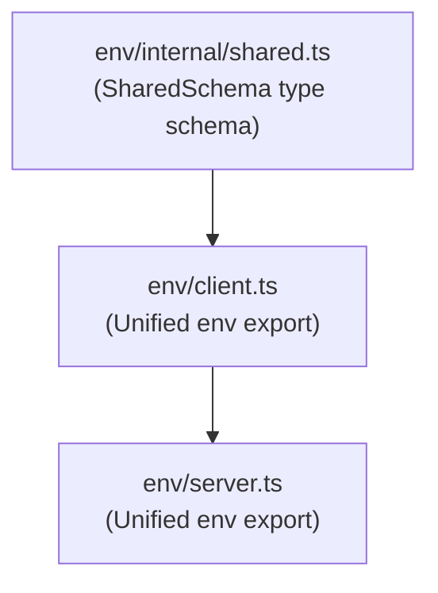

> [!IMPORTANT]
> This integration requires [ArkType](https://arktype.io) to be installed.

The `@arkenv/nextjs` integration provides end-to-end environment validation for both the server and the browser. It catches configuration bugs early in your build pipeline and prevents sensitive server-side variables from ever reaching client components.

## Recommended Layout (Unified 1-File)

For the best developer experience, we recommend the **Unified 1-file layout** (`src/env.ts`). It defines both client and server schemas in a single file, eliminating the friction of managing imports and boundaries across multiple environment files.

ArkEnv features a runtime proxy that prevents server-side secrets from leaking to the client, ensuring this setup is sufficiently secure for most applications.

<Steps>
  <Step>
    ### Configure environment

    Create an `env.ts` file (typically in `src/env.ts` or at the root of your project) to define your schemas. Import `createEnv` from the auto-generated `./generated/env.gen.ts` helper file (rather than importing directly from `@arkenv/nextjs`):

    ```ts title="src/env.ts" twoslash
    // @filename: generated/env.gen.ts
    import { createEnv as coreCreateEnv } from "@arkenv/nextjs";
    import type { type as at, distill } from "arktype";
    export { type } from "@arkenv/nextjs";

    export function createEnv<
    	const TServer = {},
    	const TClient = {},
    	const TShared = {},
    >(options: {
    	server?: TServer;
    	client?: TClient;
    	shared?: TShared;
    }): Readonly<distill.Out<at.infer<TServer & TClient & TShared>>> {
    	return {} as any;
    }

    // @filename: env.ts
    // ---cut---
    import { createEnv } from "./generated/env.gen";

    export const env = createEnv({
    	server: {
    		DATABASE_URL: "string",
    	},
    	client: {
    		NEXT_PUBLIC_API_URL: "string",
    	},
    	shared: {
    		NODE_ENV: "string",
    	},
    });
    ```
  </Step>

  <Step>
    ### Register configuration wrapper

    Wrap your Next.js configuration in `next.config.ts` (or `next.config.js`) using the `withArkEnv` helper from `@arkenv/nextjs/config`. This statically scans your schema, generates the `env.gen.ts` file, and automatically regenerates it on changes during development:

    ```ts title="next.config.ts"
    import { withArkEnv } from "@arkenv/nextjs/config";
    import type { NextConfig } from "next";

    const nextConfig: NextConfig = {
    	/* config options here */
    };

    export default withArkEnv(nextConfig);
    ```

    You can customize the schema and output paths using optional parameters:

    ```ts
    export default withArkEnv(nextConfig, {
    	schemaPath: "src/env.ts",              // Path to your schema (default: src/env.ts or env.ts)
    	outputPath: "src/generated/env.gen.ts", // Custom output path (default: src/generated/env.gen.ts)
    });
    ```

    > [!NOTE]
    > If you scaffolded your project using the `--no-codegen` CLI option, you do not need to wrap your configuration with `withArkEnv`. The CLI will have scaffolded the manual `runtimeEnv` destructuring pattern in `env.ts` instead.

    > [!TIP]
    > We recommend committing the generated `generated/env.gen.ts` file to Git. This ensures TypeScript types are immediately available on a clean clone or inside CI pipelines without requiring a build step first.
  </Step>

  <Step>
    ### Use in your code

    Import `env` throughout your Next.js application:

    ```ts title="src/app/page.tsx" twoslash
    // @filename: generated/env.gen.ts
    import { createEnv as coreCreateEnv } from "@arkenv/nextjs";
    import type { type as at, distill } from "arktype";
    export { type } from "@arkenv/nextjs";
    export function createEnv<
    	const TServer = {},
    	const TClient = {},
    	const TShared = {},
    >(options: {
    	server?: TServer;
    	client?: TClient;
    	shared?: TShared;
    }): Readonly<distill.Out<at.infer<TServer & TClient & TShared>>> {
    	return {} as any;
    }

    // @filename: env.ts
    import { createEnv } from "./generated/env.gen";
    export const env = createEnv({
    	server: { DATABASE_URL: "string" },
    	client: { NEXT_PUBLIC_API_URL: "string" },
    });

    // @filename: page.tsx
    // ---cut---
    import { env } from "./env";

    // Access is fully typesafe and autocompleted
    const apiUrl = env.NEXT_PUBLIC_API_URL;
    //      ^?
    ```

    If you accidentally attempt to access a server-side secret in a Client Component, it will throw a descriptive runtime exception during both server-side pre-rendering (SSR) and browser runtime execution:

    ```ts title="src/app/client-component.tsx" twoslash
    // @filename: generated/env.gen.ts
    import { createEnv as coreCreateEnv } from "@arkenv/nextjs";
    import type { type as at, distill } from "arktype";
    export { type } from "@arkenv/nextjs";
    export function createEnv<
    	const TServer = {},
    	const TClient = {},
    	const TShared = {},
    >(options: {
    	server?: TServer;
    	client?: TClient;
    	shared?: TShared;
    }): Readonly<distill.Out<at.infer<TServer & TClient & TShared>>> {
    	return {} as any;
    }

    // @filename: env.ts
    import { createEnv } from "./generated/env.gen";
    export const env = createEnv({
    	server: { DATABASE_URL: "string" },
    	client: { NEXT_PUBLIC_API_URL: "string" },
    });

    // @filename: client-component.tsx
    // ---cut---
    import { env } from "./env";

    // Throws a runtime error if evaluated in a client component (during SSR or in the browser)
    const dbUrl = env.DATABASE_URL;
    //      ^?
    ```
  </Step>
</Steps>

---

## Alternative: Strict Layout (Separate Files)

> [!WARNING]
> While defining both the client and server schemas in a single file provides the best developer experience, it also means that your validation schemas for the server variables will be shipped to the client. If you consider the names of your variables sensitive, you should split your schemas into separate files.

For maximum security, you can use a **3-file layout** (`env/internal/shared.ts` → `env/client.ts` → `env/server.ts`). This structure aligns with Next.js's native `use client` boundary model, ensures that server secrets are compile-time locked from browser bundles, and allows a single unified `env` export path.



### 1. Define Shared Variables

Create `env/internal/shared.ts` to define schema variables that are shared across both the client and the server. We treat this as a runtime type, so it is defined using PascalCase:

```ts title="src/env/internal/shared.ts" twoslash
import { type } from "@arkenv/nextjs/shared";

/**
 * @internal 🛑 INTERNAL SCHEMA ONLY.
 * Do not import this directly. Import `env` from `./client` or `./server` instead.
 */
export const SharedSchema = type({
	NODE_ENV: "'development' | 'production' | 'test' = 'development'",
});
```

### 2. Define Client Variables

Create `env/client.ts` using `@arkenv/nextjs/client`. All local keys **must** be prefixed with `NEXT_PUBLIC_`. You must extend `SharedSchema` and provide the destructured `runtimeEnv`:

```ts title="src/env/client.ts" twoslash
// @filename: env/internal/shared.ts
import { type } from "@arkenv/nextjs/shared";
/**
 * @internal 🛑 INTERNAL SCHEMA ONLY.
 * Do not import this directly. Import `env` from `./client` or `./server` instead.
 */
export const SharedSchema = type({
	NODE_ENV: "'development' | 'production' | 'test' = 'development'",
});

// @filename: env/client.ts
// ---cut---
import arkenv from "@arkenv/nextjs/client";
import { SharedSchema } from "./internal/shared";

export const env = arkenv(
	{
		NEXT_PUBLIC_API_URL: "string = 'https://api.example.com'",
	},
	{
		extends: [SharedSchema],
		runtimeEnv: {
			NEXT_PUBLIC_API_URL: process.env.NEXT_PUBLIC_API_URL,
			NODE_ENV: process.env.NODE_ENV,
		},
	},
);
```

### 3. Define Server Variables

Create `env/server.ts` using `@arkenv/nextjs/server`. It extends the client `env` to merge all client, shared, and server variables into a single output:

```ts title="src/env/server.ts" twoslash
// @filename: env/internal/shared.ts
import { type } from "@arkenv/nextjs/shared";
/**
 * @internal 🛑 INTERNAL SCHEMA ONLY.
 * Do not import this directly. Import `env` from `./client` or `./server` instead.
 */
export const SharedSchema = type({
	NODE_ENV: "'development' | 'production' | 'test' = 'development'",
});

// @filename: env/client.ts
import arkenv from "@arkenv/nextjs/client";
import { SharedSchema } from "./internal/shared";
export const env = arkenv(
	{ NEXT_PUBLIC_API_URL: "string" },
	{
		extends: [SharedSchema],
		runtimeEnv: {
			NEXT_PUBLIC_API_URL: process.env.NEXT_PUBLIC_API_URL,
			NODE_ENV: process.env.NODE_ENV,
		},
	},
);

// @filename: env/server.ts
// ---cut---
import arkenv from "@arkenv/nextjs/server";
import { env as clientEnv } from "./client";

export const env = arkenv(
	{
		DATABASE_URL: "string",
	},
	{
		extends: [clientEnv],
	},
);
```

### Unified Usage in Your Application

Both `env/client.ts` and `env/server.ts` export the resolved environment as `env`. This lets you use consistent `env.MY_VAR` imports depending on where the component executes.

#### In Server Components / Routes

Import `env` from the server file. It contains all public, shared, and server-only variables:

```ts title="src/app/page.ts" twoslash
// @filename: env/internal/shared.ts
import { type } from "@arkenv/nextjs/shared";
/**
 * @internal 🛑 INTERNAL SCHEMA ONLY.
 * Do not import this directly. Import `env` from `./client` or `./server` instead.
 */
export const SharedSchema = type({ NODE_ENV: "'development' | 'production' | 'test'" });

// @filename: env/client.ts
import arkenv from "@arkenv/nextjs/client";
import { SharedSchema } from "./internal/shared";
export const env = arkenv(
	{ NEXT_PUBLIC_API_URL: "string" },
	{ extends: [SharedSchema], runtimeEnv: { NEXT_PUBLIC_API_URL: "https://api.example.com", NODE_ENV: "development" } }
);

// @filename: env/server.ts
import arkenv from "@arkenv/nextjs/server";
import { env as clientEnv } from "./client";
export const env = arkenv(
	{ DATABASE_URL: "string" },
	{ extends: [clientEnv] }
);

// @filename: page.ts
// ---cut---
import { env } from "./env/server";

export function Page() {
	// Access database URL and client API URL safely
	const db = env.DATABASE_URL;
	const api = env.NEXT_PUBLIC_API_URL;
	return `API: ${api}`;
}
```

#### In Client Components

Import `env` from the client file (`env/client.ts`). The boundary protection works at two levels:

1. **TypeScript Type Safety**: If you import `env` from the client file and try to access a server-side variable (like `DATABASE_URL`), you will get a TypeScript compilation error because it is not defined in the client-safe schema:

```ts title="src/app/client-component.ts" twoslash
// @filename: env/internal/shared.ts
import { type } from "@arkenv/nextjs/shared";
/**
 * @internal 🛑 INTERNAL SCHEMA ONLY.
 * Do not import this directly. Import `env` from `./client` or `./server` instead.
 */
export const SharedSchema = type({ NODE_ENV: "'development' | 'production' | 'test'" });

// @filename: env/client.ts
import arkenv from "@arkenv/nextjs/client";
import { SharedSchema } from "./internal/shared";
export const env = arkenv(
	{ NEXT_PUBLIC_API_URL: "string" },
	{ extends: [SharedSchema], runtimeEnv: { NEXT_PUBLIC_API_URL: "https://api.example.com", NODE_ENV: "development" } }
);

// @filename: client-component.ts
// ---cut---
import { env } from "./env/client";

export function ClientComponent() {
	const api = env.NEXT_PUBLIC_API_URL;
	// @ts-expect-error DATABASE_URL is not defined in client env
	const db = env.DATABASE_URL;

	return `API URL: ${api}`;
}
```

2. **Compile-Time Isolation**: If you accidentally import `env` from the server file (`env/server.ts`) in a Client Component (or any file imported by one), Next.js's bundler will fail the build with a compilation error. This is because `@arkenv/nextjs/server` imports Next.js's native `server-only` package to block browser compilation of server code.

---

## Scaffolding with CLI

The fastest way to set up the environment configuration is using the CLI. Run the `init` command in your project directory:

```bash
npx @arkenv/cli@latest init
```

The interactive wizard will detect Next.js and prompt you for the layout structure. The **Unified (Recommended)** layout setup is selected by default.

### Skipping prompts (flags)

- **Simple Mode**: Force the 1-file layout and skip prompts.
  ```bash
  npx @arkenv/cli@latest init --simple
  ```
- **Strict Mode**: Force the 3-file layout and skip prompts.
  ```bash
  npx @arkenv/cli@latest init --strict
  ```

---

## Using Zod or Valibot

You can freely mix Zod or Valibot schemas with standard schemas. Standard Schema is supported out of the box.

### Unified 1-File Layout

Here is an example using Zod with the 1-file codegen layout:

```ts title="src/env.ts" twoslash
// @filename: generated/env.gen.ts
import { createEnv as coreCreateEnv } from "@arkenv/nextjs";
import type { type as at, distill } from "arktype";
export { type } from "@arkenv/nextjs";
export function createEnv<
	const TServer = {},
	const TClient = {},
	const TShared = {},
>(options: {
	server?: TServer;
	client?: TClient;
	shared?: TShared;
}): Readonly<distill.Out<at.infer<TServer & TClient & TShared>>> {
	return {} as any;
}

// @filename: env.ts
// ---cut---
import { createEnv } from "./generated/env.gen";
import { z } from "zod";

export const env = createEnv({
	server: {
		DATABASE_URL: z.string().url(),
	},
	client: {
		NEXT_PUBLIC_API_URL: z.string().url(),
	},
	shared: {
		NODE_ENV: z.enum(["development", "production", "test"]),
	},
});
```

### 3-File Layout

You can freely mix Zod or Valibot schemas with the 3-file layout:

<Tabs items={['Zod', 'Valibot']}>
  <Tab value="Zod">
    ```ts title="src/env/internal/shared.ts" twoslash
    import { z } from "zod";

    /**
     * @internal 🛑 INTERNAL SCHEMA ONLY.
     * Do not import this directly. Import `env` from `./client` or `./server` instead.
     */
    export const SharedSchema = z.object({
    	NODE_ENV: z.enum(["development", "production", "test"]).default("development"),
    });
    ```
  </Tab>

  <Tab value="Valibot">
    ```ts title="src/env/internal/shared.ts" twoslash
    import * as v from "valibot";

    /**
     * @internal 🛑 INTERNAL SCHEMA ONLY.
     * Do not import this directly. Import `env` from `./client` or `./server` instead.
     */
    export const SharedSchema = v.object({
    	NODE_ENV: v.optional(v.picklist(["development", "production", "test"]), "development"),
    });
    ```
  </Tab>
</Tabs>
