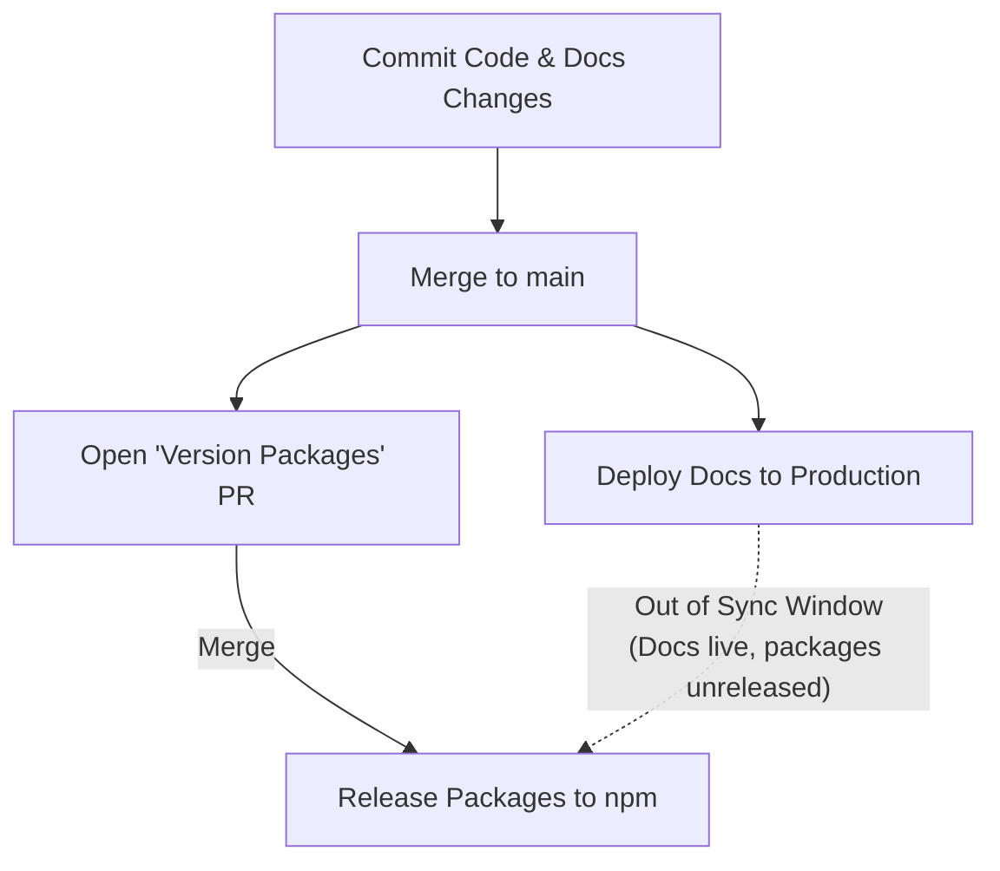
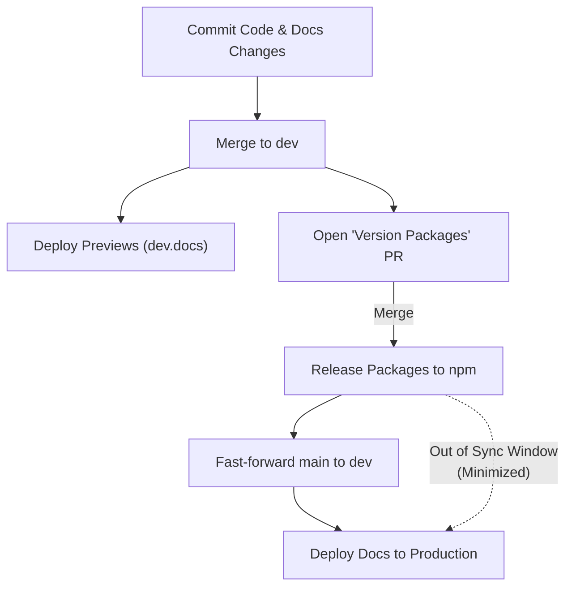
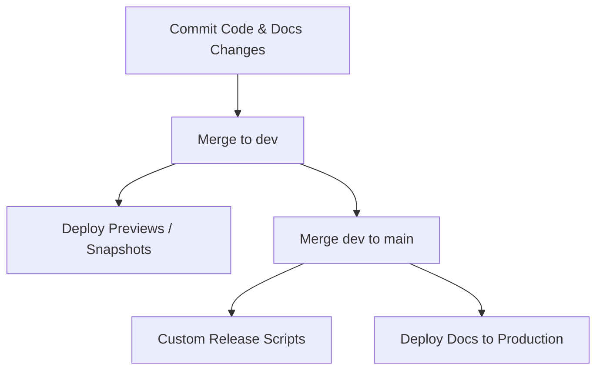
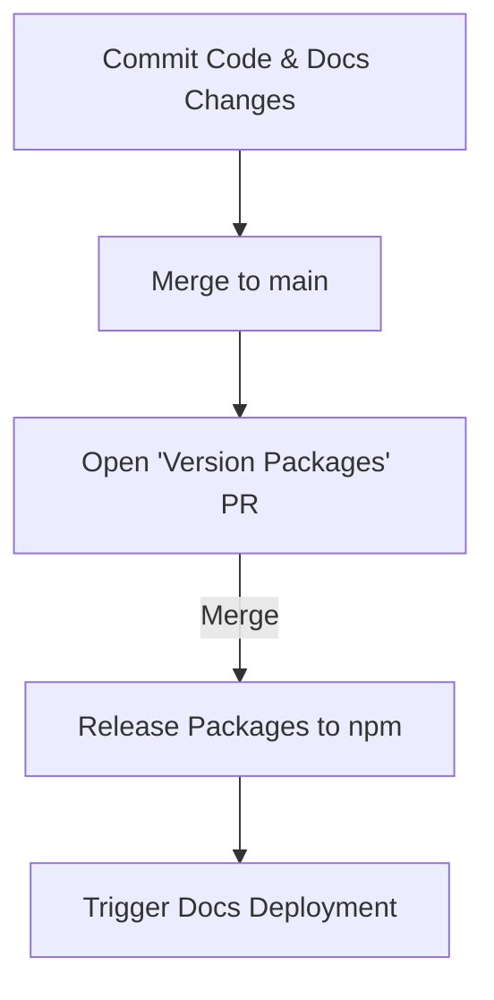
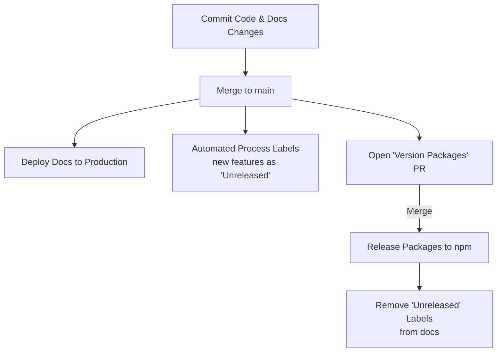
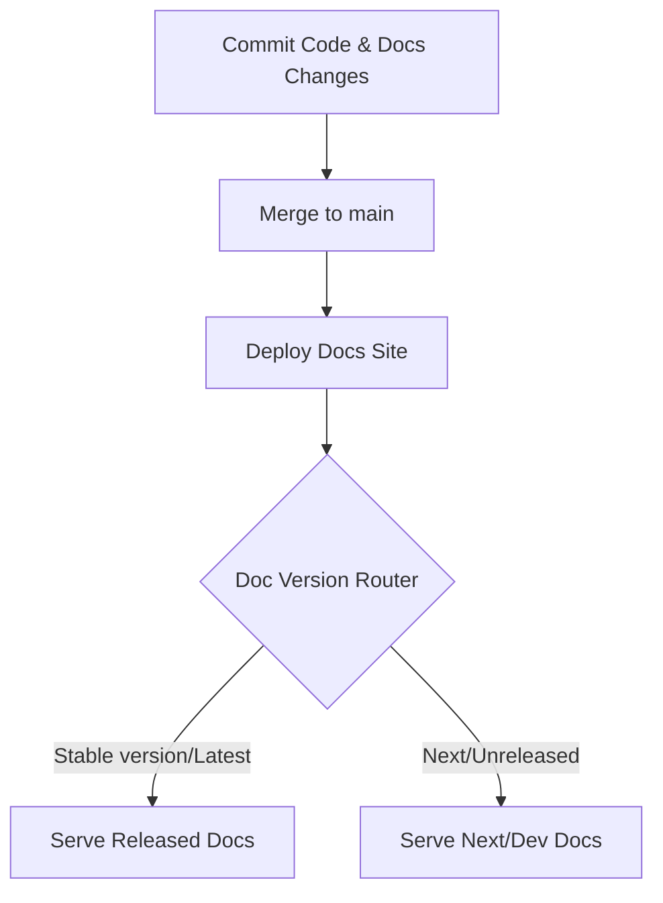
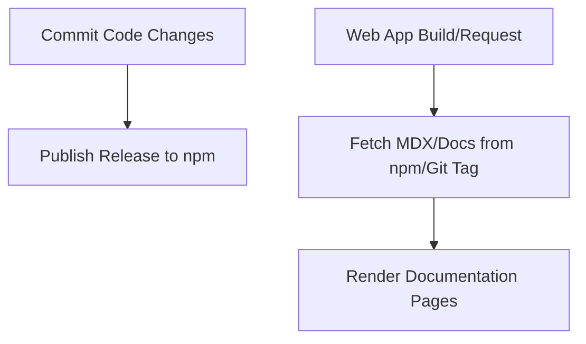

# Branching and release flow

To document the architectural decision on the repository's branching model, release cycle, and documentation deployment workflow, transitioning to a two-branch (`dev`/`main`) system using Changesets.

## Context & problem

We manage a monorepo containing published npm packages (`packages/*`) and a documentation website (`apps/www`). The documentation website must reflect the features and state of the released packages in production:

1. If we deploy the documentation site directly on every merge to a single default branch (`main`), the website will display documentation for features that have been merged but not yet released on npm (out of sync).
2. During the time a Changesets-generated "Version Packages" PR is open, any subsequent commits can cause packages and documentation to get further out of sync.
3. We need a way to immediately push documentation-only typo fixes to production without waiting for the next package release cycle.

We analyzed 5 different models to address these constraints:

### Model 1: Pure Changesets Flow (Main Flow)

A single `main` branch where code and doc changes are committed. Merging to `main` deploys the docs to production immediately, while packages are only released when the "Version Packages" PR is merged.

- **Con**: During the window between merging a feature and merging the "Version Packages" PR, the docs are out of sync with npm.

### Model 2: Dev/Main Flow with Changesets (Selected Option)

Development and feature PRs target a default `dev` branch. Previews are deployed from `dev`. Merging the "Version Packages" PR on `dev` publishes packages and fast-forwards `main`, which triggers the production doc deployment.

- **Pro**: Minimizes the out-of-sync window in production.
- **Pro**: Allows selective/early docs hotfixes to be cherry-picked onto `main` via helper scripts.

### Model 3: Dev/Main Flow without Changesets

Traditional dev/main branching model, but without Changesets. Releases are manually built and pushed from `main`.

- **Con**: High manual release overhead and loss of automated version/changelog generation.

### Model 4: Main Flow + Selective Docs Deployment

Single `main` branch, but docs are only deployed when a release is published (e.g. triggered by tag/release events).

- **Con**: Hard to deploy critical typo/documentation fixes while a package version release is pending on `main`.

### Model 5: Main Flow + Version Labeling

Single `main` branch. Docs are deployed immediately, but an automated process labels documentation sections matching new features as "unreleased" until the package is published.

- **Con**: High configuration and maintenance complexity; fragile to parse doc changes.

### Model 6: Multi-Version / Versioned Documentation

The website is always deployed from a single branch (e.g., `main`). The documentation website natively supports versioning (e.g., using a framework-level version selector).

- **Pro**: Unreleased changes are clearly marked under a `/docs/next` path, while `/docs` points to the latest stable release.
- **Pro**: Decouples website deployment from the package release cycle.
- **Con**: Higher setup/configuration complexity for maintaining versioned documentation folders and route mappings.

### Model 7: Dynamic NPM/Tag-based Documentation

The documentation website code and content are decoupled. The website fetches and renders documentation content dynamically at build or run time from the published npm packages or specific git tags.

- **Pro**: Decouples website deployment completely from package releases. The website can be updated and deployed anytime without displaying unreleased features.
- **Con**: Relies on external dynamic fetching (increased risk of build failures or runtime API limits) and lacks simple local MDX previews during development without extra emulation.

## Decision

We chose **Model 2: Dev/Main Flow with Changesets**.

- Development takes place on the default `dev` branch.
- Changesets manage versioning and trigger package releases when merged to `dev`.
- Merging the Version Packages PR triggers package publishing, fast-forwards `main` to `dev`, and pushes to GitHub, deploying the production documentation site.
- If documentation hotfixes (like typo fixes) need to be deployed to production early without waiting for the next package release, we use the local helper script `./scripts/sync-main.sh` to cherry-pick them to `main` and then reconcile `dev`.

## Consequences

- **Production Safety**: The production documentation site is kept in sync with published npm versions automatically.
- **Branch Management**: Developers must target `dev` for feature PRs.
- **Docs Hotfixes**: Doc-only updates can be published to `main` early using automated cherry-picking, avoiding history drift.
- **Release Automation**: Release pipelines are fully automated via Changesets and GitHub Actions.

---

**References**:

- [CONTRIBUTING.md](../CONTRIBUTING.md)
