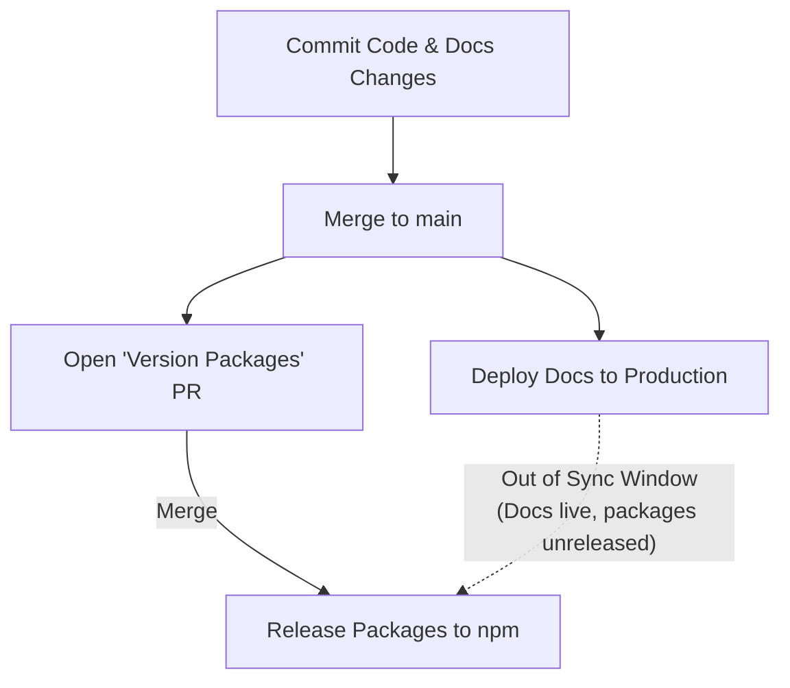
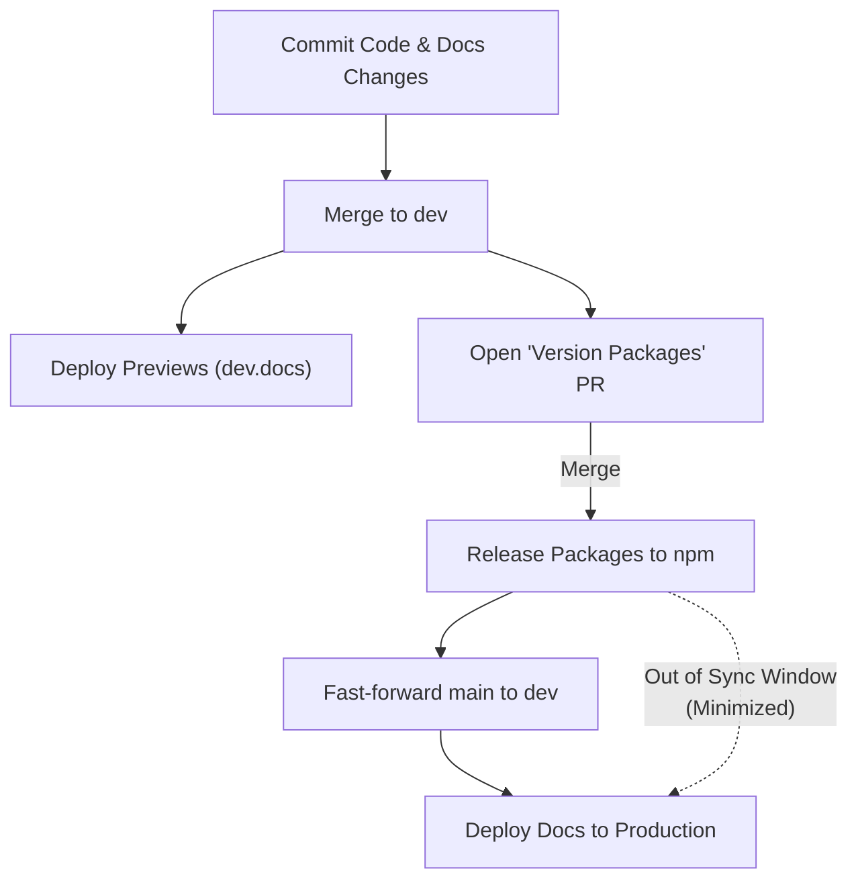
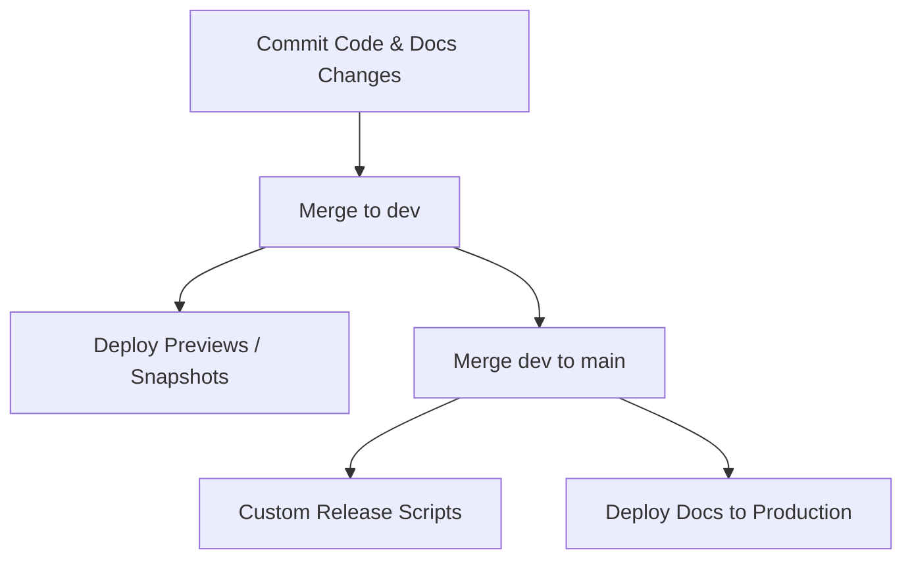
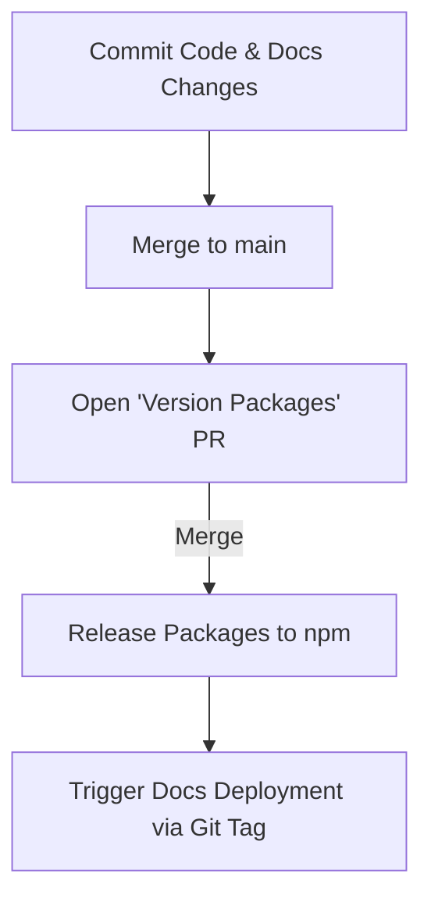
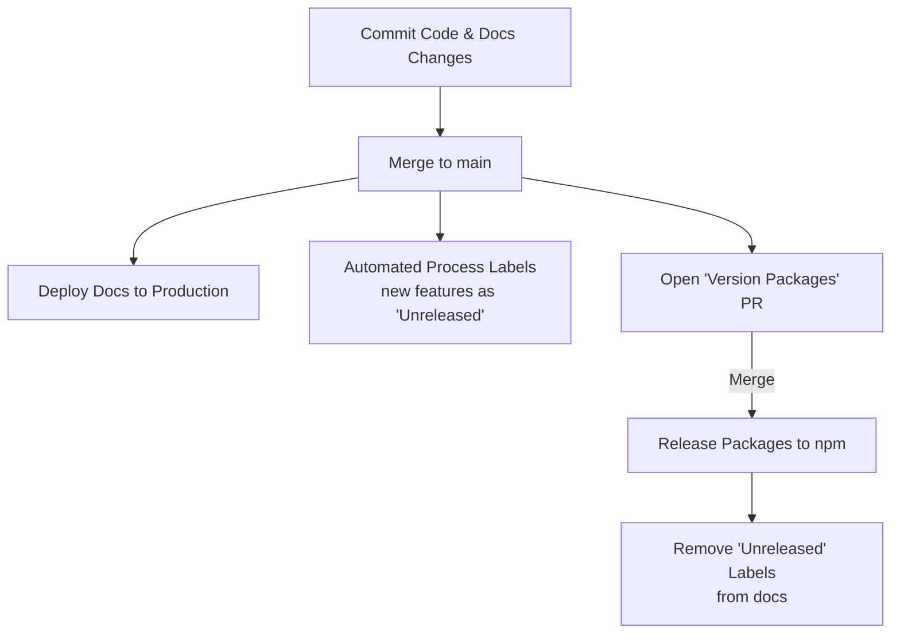
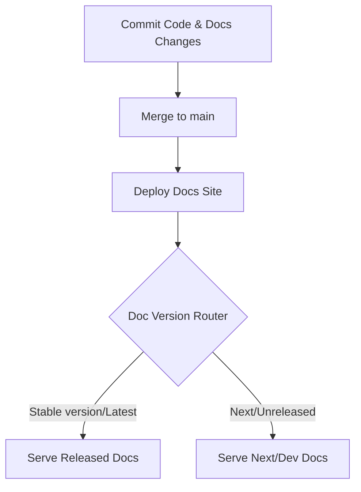
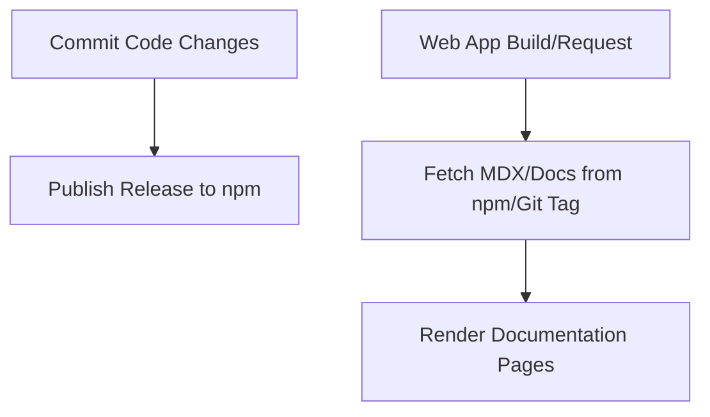

# Branching and Release Flow

To document the architectural decision on the repository's branching model, package release cycle, and documentation deployment workflow, transitioning to a dual-branch (`dev`/`main`) release flow managed by Changesets.

## Context & Problem

We manage a monorepo containing published npm packages (`packages/*`) and a documentation website (`apps/www`). The documentation website must accurately reflect the features and state of the released packages in production.

This requirement introduces several constraints:

1. **Out-of-Sync Prevention**: If we deploy the documentation site directly on every merge to a single default branch (`main`), the website will display documentation for features that have been merged but not yet released on npm (out of sync).
2. **Release Staging Window**: During the time a Changesets-generated "Version Packages" PR is open, subsequent commits to the development branch can cause packages and documentation to diverge further before a release is finalized.
3. **Fast-track Doc Hotfixes**: We need a way to immediately push documentation-only typo fixes to production without waiting for the next package release cycle.
4. **AI & LLM Crawler Alignment**: Developers increasingly rely on AI coding assistants (such as Gemini, Copilot, or ChatGPT) that fetch documentation via machine-readable endpoints (`/llms.txt`, `/llms-full.txt`, and page-level `.md`/`.mdx` routes). If the production site serves unreleased APIs or features on these endpoints, LLM assistants will suggest non-existent code to developers, leading to broken developer experiences.

We analyzed seven different models to address these constraints:

### Model 1: Trunk-Based Development with Changesets

A single default branch (`main`) where code and doc changes are committed. Merging to `main` deploys the docs to production immediately, while packages are only released when the Changesets "Version Packages" PR is merged.

- **Con**: During the window between merging a feature and merging the "Version Packages" PR, the documentation is out of sync with npm.

### Model 2: Dual-Branch Development and Release Flow (Selected Option)

Development and feature PRs target a default `dev` branch. Previews are deployed from `dev`. Merging the "Version Packages" PR into `dev` publishes packages and fast-forwards `main`, which triggers the production doc deployment.

- **Pro**: Minimizes the out-of-sync window in production to the build/deployment time of the release.
- **Pro**: Allows selective/early docs hotfixes to be cherry-picked onto `main` and then reconciled back into `dev`.

### Model 3: Traditional Dual-Branch Flow without Changesets

Traditional dev/main branching model, but without automated release tooling. Releases are manually built and pushed from `main`.

- **Con**: High manual release overhead and loss of automated version/changelog generation.

### Model 4: Trunk-Based Development with Tag-Triggered Deployments

Single default branch (`main`), but documentation is only deployed when a new release tag is published.

- **Con**: Hard to deploy critical typo/documentation fixes while a package version release is pending on `main`.

### Model 5: Trunk-Based Development with Feature-Flagged/Labeled Documentation

Single default branch. Docs are deployed immediately, but an automated process labels documentation sections matching new features as "unreleased" until the package is published.

- **Con**: High configuration and maintenance complexity; fragile to parse doc changes.

### Model 6: Multi-Versioned Documentation Site

The website is always deployed from a single branch (e.g., `main`). The documentation website natively supports versioning (e.g., using a framework-level version selector).

- **Pro**: Unreleased changes are clearly marked under a `/docs/next` path, while `/docs` points to the latest stable release.
- **Pro**: Decouples website deployment from the package release cycle.
- **Con**: Higher setup/configuration complexity for maintaining versioned documentation folders and route mappings.

### Model 7: Runtime/Build-Time Remote Documentation Fetching

The documentation website code and content are decoupled. The website fetches and renders documentation content dynamically at build or run time from the published npm packages or specific git tags.

- **Pro**: Decouples website deployment completely from package releases.
- **Con**: Relies on external dynamic fetching (increased risk of build failures or runtime API limits) and lacks simple local MDX previews during development.

---

## Decision

We chose **Model 2: Dual-Branch Development and Release Flow**.

### Branching Scheme

- **`dev` (Default Branch)**: All active development, feature branches, and dependency updates target `dev`. Preview deployments are triggered from here.
- **`main` (Production Branch)**: Represents the production state. Direct commits are forbidden. It is only updated via fast-forward merges from `dev` or approved doc-rescue PRs.

### AI & LLM Documentation Endpoints

To align with modern conventions (like those on `fumadocs.dev`), the documentation site serves dedicated machine-readable endpoints for AI agents. This branching and release model guarantees their integrity:

- **`/llms.txt` (Index)**: Serves a structured plain-text index of the documentation page tree.
- **`/llms-full.txt` (Full Context)**: Serves a concatenated markdown document containing all documentation pages for single-pass ingestion.
- **`*.md` / `*.mdx` Page Endpoints**: Rewrites request paths to serve page-specific raw markdown (e.g. `/docs/arkenv.md` or `Accept: text/markdown`).

Production crawlers hitting these endpoints on the main domain (e.g., `arkenv.dev/llms.txt`) are guaranteed to only retrieve documentation matching released package versions. In preview environments (deployed from `dev`), these endpoints expose unreleased features, facilitating prompt engineering and agent verification during development.

### Automated Release Loop

1. **Staging**: Merging a feature PR containing a changeset into `dev` triggers the Changesets GitHub Action to open or update the **"Version Packages" PR** targeting `dev`.
2. **Release**: Merging the "Version Packages" PR into `dev` runs [`release.yml`](file:///.github/workflows/release.yml) which:
   - Publishes the bumped packages to npm (via `changeset publish`).
   - Programmatically merges `dev` into `main` with a fast-forward (`--ff-only`) constraint.
   - Pushes `main` to GitHub.
3. **Deployment**: Pushing to `main` triggers [`deploy-www.yml`](file:///.github/workflows/deploy-www.yml) which builds and deploys the updated documentation site to production.

### Hotfix Cherry-Picking and Branch Reconciliation

If documentation hotfixes (such as typo fixes or formatting corrections) need to be deployed to production immediately without waiting for a package release, we run a two-part manual/CI flow:

1. **Rescue (Cherry-pick to `main`)**: Run `./scripts/sync-main.sh rescue <commit-hashes>` locally. This cuts a hotfix branch from `main`, cherry-picks the specified doc commits from `dev`, and opens a PR targeting `main`. Once merged, the production docs deploy immediately.
2. **Reconciliation (Preventing History Drift)**: After the rescue PR is merged, the developer **must** run `./scripts/sync-main.sh reconcile`. This merges `main` back into `dev`, aligning their git histories and ensuring future automated `--ff-only` merges do not fail due to divergence.

---

## Consequences

- **Production Safety**: The production documentation site is kept in sync with published npm versions automatically, eliminating the risk of documenting unreleased APIs.
- **AI Prompting Integrity**: AI coding assistants indexing the production site only ingest documentation for released package versions, eliminating code suggestion failures or unreleased API hallucinations for package consumers.
- **Strict Branch Discipline**: Developers must target `dev` for feature PRs. Direct PRs to `main` are restricted to emergency hotfixes via the `rescue` workflow.
- **No History Drift**: The required reconciliation step ensures that any hotfix merged to `main` is brought back into `dev`, maintaining a clean topological relationship where `dev` is always a direct descendant of `main`.
- **Robust Release Automation**: Release pipelines are fully automated, removing the need for manual publishing or manual syncing of git tags and branches.

---

**References**:

- [CONTRIBUTING.md](../CONTRIBUTING.md)
- [skills/changeset/SKILL.md](../../skills/changeset/SKILL.md) (Changeset formatting guidelines, imperative mood requirement, and v0 versioning rules)
- [scripts/sync-main.sh](../../scripts/sync-main.sh)
- [.github/workflows/release.yml](../../.github/workflows/release.yml)
- [.github/workflows/deploy-www.yml](../../.github/workflows/deploy-www.yml)
- [.github/workflows/sync-main.yml](../../.github/workflows/sync-main.yml)
- [apps/www/app/llms.txt/route.ts](../../apps/www/app/llms.txt/route.ts) (Fumadocs `llms.txt` page tree index)
- [apps/www/app/llms-full.txt/route.ts](../../apps/www/app/llms-full.txt/route.ts) (Concatenated LLM text generator)
- [apps/www/app/llms.mdx/docs/\[\[...slug\]\]/route.ts](../../apps/www/app/llms.mdx/docs/\[\[...slug]]/route.ts) (Page-specific markdown endpoint)
- [apps/www/next.config.ts](../../apps/www/next.config.ts) (Rewrite rules for `.md` / `.mdx` content extensions)
