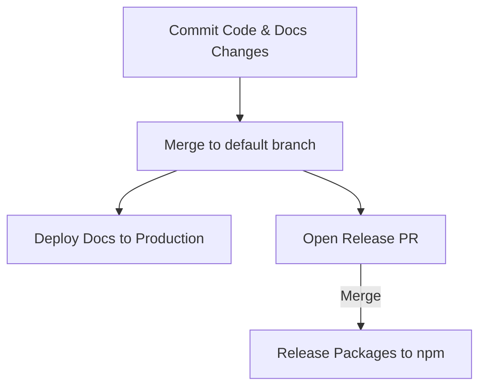
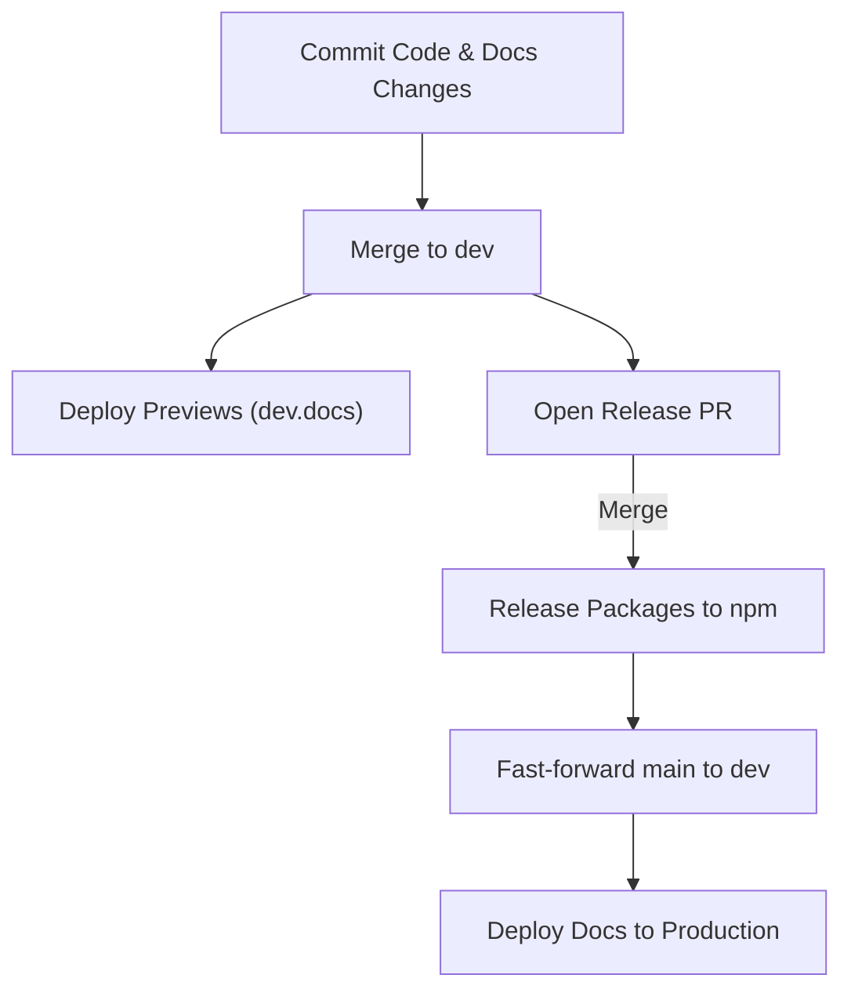

# Branching and Release Models Overview

This document provides an objective overview of different branching, package release, and documentation deployment models commonly used in monorepos. It outlines the mechanics of each model and provides examples from open-source repositories.

## 1. Trunk-Based Development with Automated Release Tooling

A single default branch (typically `main` or `dev`) serves as the target for all code and documentation changes. Release tools (like Changesets) automatically generate a "Version Packages" pull request based on merged changes.

- **Mechanics:** Merging the release PR triggers the pipeline to build and publish the packages to npm.
- **Documentation:** Usually deployed to production immediately on every merge to the default branch. This can create a window where documentation for unreleased features is live before the release PR is merged.
- **Real-World Examples:**
  - **[Fumadocs](../repos/fumadocs):** Default branch `dev`. Uses Changesets for package releases. Documentation is deployed immediately on commits to `dev`.
  - **[TanStack Query](../repos/query) & [Router](../repos/router):** Default branch `main`. Uses Changesets with support for pre-release and maintenance branches.
  - **[t3-env](../repos/t3-env):** Default branch `main`. Uses Changesets combined with custom Bun scripts for publishing.

## 2. Dual-Branch Development and Release Flow

This model separates active development from production state using two branches (e.g., `dev` and `main`).

- **Mechanics:** Feature PRs target `dev`. Release tooling opens a release PR against `dev`. Merging the release PR publishes packages and then automatically fast-forwards or syncs the `main` branch to match `dev`.
- **Documentation:** Preview documentation environments are deployed from `dev`. Production documentation is strictly deployed from `main` after packages are successfully published.
- **Real-World Examples:**
  - **[Astro](../repos/astro) (Hybrid approach):** Active development targets `main` and uses Changesets. Post-release, an automated workflow reconciles changes back into a `next` branch (used for the next major/minor cycle), sometimes utilizing AI-assisted conflict resolution.

## 3. Trunk-Based with Continuous Canary and Scripted Releases

Development occurs on a single branch, but releases rely on custom scripts, version detection, or continuous pre-release systems rather than open release PRs.

- **Mechanics:** Merges to the default branch automatically trigger pre-release (canary) publishes. Stable releases are triggered either by a custom script detecting a version bump in `package.json`, or manually via workflow dispatch.
- **Real-World Examples:**
  - **[ArkType](../repos/arktype):** Push to `main` runs a custom TypeScript script. If the `package.json` version does not match an existing Git tag, it automatically tags and publishes the stable release.
  - **[Zod](../repos/zod):** Push to `main` runs a publish action. It checks the version; if new, it publishes a stable release. Otherwise, it automatically generates and publishes a canary version.
  - **[tRPC](../repos/trpc):** Lerna publishes a canary release on every merge to `main`. Stable releases are triggered manually via GitHub Actions UI.

## 4. Staging Branches and Tag-Triggered Releases

Instead of relying solely on the default branch for release pipelines, this model uses temporary branches to isolate the build and publish steps.

- **Mechanics:** A scheduled or manual release cuts a temporary `staging-[version]` branch. The build, test, and npm publish steps occur here. Only upon successful publication is a Git tag created, and the staging branch is automatically merged back into `main`.
- **Real-World Examples:**
  - **[Turborepo](../repos/turbo):** Hourly cron or manual bumps trigger the creation of a staging branch. If the publish succeeds, it tags the release and auto-merges the PR. If any step fails, the temporary branch is deleted, preventing broken releases from affecting `main`.

## 5. Feature-Flagged or Versioned Documentation Architectures

Rather than solving synchronization through Git branching, this approach handles unreleased features at the documentation application level.

- **Full Versioning (Branch-Based):** Entire documentation sites are isolated by deploying separate Git branches (e.g., `v1`, `v2`) to distinct subdomains.
- **Partial Versioning (Folder-Based):** Storing multiple versions under a single branch (e.g., `/docs/v1`, `/docs/next`). Unreleased changes are placed in a `/next` directory and merged into the stable directory upon release.
- **Runtime Remote Fetching:** The website application fetches Markdown content from published npm packages or Git tags at build-time or run-time, fully decoupling the documentation deploy from the codebase repository.
